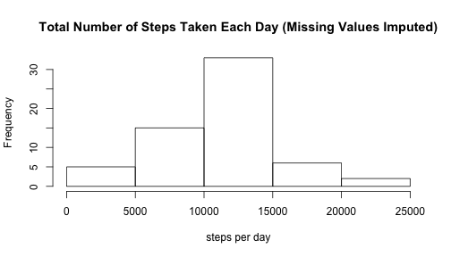

## Loading and preprocessing the data


```r
library(plyr)
```

Unzip the data.  The zip file activity.zip was part of the original project,
forked from https://github.com/rdpeng/RepData_PeerAssessment1


```r
unzip("activity.zip")
originaldata <- read.csv("activity.csv")
```

Convert date factor to date

```r
originaldata$datePosix <- as.POSIXlt(originaldata$date)
```

Add the interval in minutes to the timestamp to get samples in 5 minute intervals


```r
addTime <- function (dateOnly, hhmm) {
  len <- nchar(hhmm)
  min <- substr(hhmm, len-1, len)
  hour <- if(len < 3) 0 else substr(hhmm, 0, len - 2)
  dateOnly$hour <- hour
  dateOnly$min <- min
  dateOnly
}

for(i in 1:length(originaldata$datePosix)) {
   originaldata$datePosix[i] <- addTime(originaldata$datePosix[i], originaldata$interval[i])  
}
```

Add a column for day of week.


```r
originaldata$wday <- originaldata$datePosix$wday
```

Create meta variables


```r
numDays <- as.integer(max(originaldata$datePosix) - min(originaldata$datePosix)) 
samplesPerDay <- length(originaldata$date) / numDays
yAxisScaleForAvgStepsPerDay <- 250
```


## What is mean total number of steps taken per day?

Summarize total data by day


```r
totalsByDay <- ddply(originaldata[1:2], .(date), numcolwise(sum))
```

### Make a histogram of the total number of steps taken each day


```r
hist(
  totalsByDay$steps, 
  main="Total Number of Steps Taken Each Day",
  xlab = "steps per day"
)
```

 

### Calculate and report the mean and median total number of steps taken per day


```r
meanStepsPerDay <- round(mean(totalsByDay$steps, na.rm = TRUE), digits = 0)
medianStepsPerDay <- median(totalsByDay$steps, na.rm = TRUE)
```


```r
print(meanStepsPerDay)
```

```
## [1] 10766
```


```r
print(medianStepsPerDay)
```

```
## [1] 10765
```

The mean total number of steps taken per day is 
10,766.

The median total number of steps taken per day is 
10,765.

## What is the average daily activity pattern?

Average the steps taken for each 5-minute interval across all the days


```r
dataMissingValuesDropped <- originaldata[!is.na(originaldata$steps),]
averageByInterval <- ddply(dataMissingValuesDropped[c(1,3)], .(interval), numcolwise(mean))
averageByInterval$steps <- round(averageByInterval$steps, digits=0)
```

### Make a time series plot (i.e. type = "l") of the 5-minute interval (x-axis) and the average number of steps taken, averaged across all days (y-axis)


```r
myts <- ts(averageByInterval$steps) 
plot(
  myts, 
  xlab="Time Interval Ordinal", 
  ylab="avg steps for 5-minute interval",
  ylim=c(0, yAxisScaleForAvgStepsPerDay)
)
title(main="Steps Taken in 5-Minute Intervals Averaged Across All Days (Missing Values Dropped)")
```

 


### Which 5-minute interval, on average across all the days in the dataset, contains the maximum number of steps?


```r
maxAvgStepsInInverval <- max(averageByInterval$steps)
maxInterval <- averageByInterval[averageByInterval$steps==maxAvgStepsInInverval,]$interval
maxIntervalAsTimeStamp <- dataMissingValuesDropped[dataMissingValuesDropped$interval == maxInterval,]$datePosix[1]
maxIntervalAsTime <- format(maxIntervalAsTimeStamp, "%H:%M")
```

The 5-minute interval with the most average steps per day occurs at 08:35 with 206 steps.


## Imputing missing values

### Calculate and report the total number of missing values in the dataset (i.e. the total number of rows with NAs)


```r
dataDirty <- originaldata[is.na(originaldata$steps),]
dirtyByDay <- ddply(dataDirty[1:2], .(date), numcolwise(length))
totalNumberOfMissingValues <- length(dataDirty$steps)
```

Here are the days with missing data out of 288 samples per day:


```r
print(dirtyByDay)
```

```
##         date steps
## 1 2012-10-01   288
## 2 2012-10-08   288
## 3 2012-11-01   288
## 4 2012-11-04   288
## 5 2012-11-09   288
## 6 2012-11-10   288
## 7 2012-11-14   288
## 8 2012-11-30   288
```

There are a total of 2304 missing value across 8 days.

### Devise a strategy for filling in all of the missing values in the dataset. The strategy does not need to be sophisticated. For example, you could use the mean/median for that day, or the mean for that 5-minute interval, etc.

Assume the average number of steps for a particular interval on a particular day of the week is relatively consistent.  Fill in missing values with the mean of the 5 minute interval for the day of week (Sun-Sat).


```r
# create lookup table
dataNoMissingValues <- originaldata[!is.na(originaldata$steps),]
averageByIntervalAndWday <- ddply(dataNoMissingValues[c(1,3,5)], .(interval, wday), numcolwise(mean))
averageByIntervalAndWday$steps <- round(averageByIntervalAndWday$steps, digits=0)
rm(dataNoMissingValues)

# create function for looking up missing values
lookupMissingValue <- function(interval, wday) {
  averageByIntervalAndWday[averageByIntervalAndWday$interval==interval & averageByIntervalAndWday$wday==wday,]$steps
}
```


### Create a new dataset that is equal to the original dataset but with the missing data filled in.


```r
# make a copy so the original data still has missing values
dataClean <- originaldata 

# lookup missing values
for(i in 1:length(dataClean$date)) {
  if(is.na(dataClean$steps[i])) {
    interval <- dataClean$interval[i]
    wday <- dataClean$wday[i]
    dataClean$steps[i] <- lookupMissingValue(interval, wday)
  }
}
```


### Make a histogram of the total number of steps taken each day and Calculate and report the mean and median total number of steps taken per day. Do these values differ from the estimates from the first part of the assignment? What is the impact of imputing missing data on the estimates of the total daily number of steps?


```r
totalsByDay <- ddply(dataClean[1:2], .(date), numcolwise(sum))
```

Make a histogram of the total number of steps taken each day


```r
hist(
  totalsByDay$steps, 
  main="Total Number of Steps Taken Each Day (Missing Values Imputed)",
  xlab = "steps per day"
)
```

 

Calculate and report the mean and median total number of steps taken per day


```r
meanStepsPerDayWithImputedData <- round(mean(totalsByDay$steps), digits = 0)
medianStepsPerDayWithImputedData <- median(totalsByDay$steps)
```


```r
print(meanStepsPerDayWithImputedData)
```

```
## [1] 10821
```


```r
print(medianStepsPerDayWithImputedData)
```

```
## [1] 11015
```

The mean total number of steps taken per day with imputed data is 
10,821.

The median total number of steps taken per day with imputed data is 
11,015.

The mean total number of steps taken per day with missing values removed is 
10,766.

The median total number of steps taken per day with missing values removed is 
10,765.

Compute percentage change of the mean and median with the imputed data.


```r
adjustmentForMean <- 100 * round((meanStepsPerDayWithImputedData - meanStepsPerDay) / meanStepsPerDay, digits=4)
adjustmentForMedian <- 100 * round((meanStepsPerDayWithImputedData - meanStepsPerDay) / meanStepsPerDay, digits=4)
print(adjustmentForMean)
```

```
## [1] 0.51
```

```r
print(adjustmentForMedian)
```

```
## [1] 0.51
```

The affect of imputing missing values on the average number of steps per day is not statistically significant.  The different in the mean is 0.51%, and the difference in the median is 0.51%.

## Are there differences in activity patterns between weekdays and weekends?

### Create a new factor variable in the dataset with two levels – “weekday” and “weekend” indicating whether a given date is a weekday or weekend day.


```r
dataClean$weekDay <- as.factor(weekdays(dataClean$datePosix))
```

### Make a panel plot containing a time series plot (i.e. type = "l") of the 5-minute interval (x-axis) and the average number of steps taken, averaged across all weekday days or weekend days (y-axis). 


```r
averageByIntervalAndWeekPart <- ddply(dataClean[c(1,3,6)], .(interval, weekDay), numcolwise(mean))
averageByIntervalAndWeekPart$steps <- averageByIntervalAndWeekPart$steps
isWeekEnd <- averageByIntervalAndWeekPart$weekDay == "Saturday" | averageByIntervalAndWeekPart$weekDay == "Sunday"

createSubSet <- function(booleanVector) {
  splitData <- averageByIntervalAndWeekPart[booleanVector,]
  averageByInterval <- ddply(splitData[c(1,3)], .(interval), numcolwise(mean))
  averageByInterval$steps <- round(averageByInterval$steps, digits=0)
  averageByInterval
}

averageByIntervalForWeekDays <- createSubSet(!isWeekEnd)
averageByIntervalForWeekEnds <- createSubSet(isWeekEnd)

par(mfrow=c(2,1))
plot(
  ts(averageByIntervalForWeekDays$steps)
  , main = "Steps Taken in 5-Minute Intervals Averaged Across Week Days (Mon-Fri)"
  , xlab = "Time Interval Ordinal"
  , ylab = "avg steps for 5-minute interval",
  ylim=c(0, yAxisScaleForAvgStepsPerDay)
  )
plot(
  ts(averageByIntervalForWeekEnds$steps)
  , main="Steps Taken in 5-Minute Intervals Averaged Across Week Ends (Sat & Sun)"
  , xlab = "Time Interval Ordinal"
  , ylab = "avg steps for 5-minute interval",
  ylim=c(0, yAxisScaleForAvgStepsPerDay)
  )
```

 

Other than the thin spike around 8:30 am on weekdays, the subject is significantly more active on weekends.
