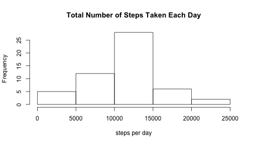

Reproducible ResearchProject One -- Todd Flanders
========================================================

# 1 - Loading and preprocessing the data


```r
library(plyr)
```

Unzip the data.  The zip file activity.zip was part of the original project,
forked from https://github.com/rdpeng/RepData_PeerAssessment1


```r
unzip("activity.zip")
originaldata <- read.csv("activity.csv")
```

Convert date factor to date

```r
originaldata$datePosix <- as.POSIXlt(originaldata$date)
```

Add the interval in minutes to the timestamp to get samples in 5 minute intervals


```r
originaldata$datePosix$min <- originaldata$datePosix$min + originaldata$interval 
```

Add a column for day of week.


```r
originaldata$wday <- originaldata$datePosix$wday
```

Create meta variables


```r
numDays <- as.integer(max(originaldata$datePosix) - min(originaldata$datePosix)) 
samplesPerDay <- length(originaldata$date) / numDays
```

Analyze missing step data


```r
dataDirty <- originaldata[is.na(originaldata$steps),]
dirtyByDay <- ddply(dataDirty[1:2], .(date), numcolwise(length))
```

Here are the days with missing data out of 288 samples per day:


```r
print(dirtyByDay)
```

```
##         date steps
## 1 2012-10-01   288
## 2 2012-10-08   288
## 3 2012-11-01   288
## 4 2012-11-04   288
## 5 2012-11-09   288
## 6 2012-11-10   288
## 7 2012-11-14   288
## 8 2012-11-30   288
```

```r
rm (dataDirty)
rm (dirtyByDay)
```
 
We will fill in missing values with the mean of the 5 minute interval for 
the day of week (Sun-Sat).


```r
# make a copy so the original data still has missing values
dataClean <- originaldata 

# create lookup table
dataNoMissingValues <- originaldata[!is.na(originaldata$steps),]
averageByIntervalAndWday <- ddply(dataNoMissingValues[c(1,3,5)], .(interval, wday), numcolwise(mean))
averageByIntervalAndWday$steps <- round(averageByIntervalAndWday$steps, digits=0)
rm(dataNoMissingValues)

# create function for looking up missing values
lookupMissingValue <- function(interval, wday) {
  averageByIntervalAndWday[averageByIntervalAndWday$interval==interval & averageByIntervalAndWday$wday==wday,]$steps
}
  
# lookup missing values
for(i in 1:length(dataClean$date)) {
  if(is.na(dataClean$steps[i])) {
    interval <- dataClean$interval[i]
    wday <- dataClean$wday[i]
    dataClean$steps[i] <- lookupMissingValue(interval, wday)
  }
}
```

Summarize total data by day


```r
totalsByDay <- ddply(dataClean[1:2], .(date), numcolwise(sum))
```

# 2 - What is mean total number of steps taken per day?

## Make a histogram of the total number of steps taken each day


```r
hist(
  totalsByDay$steps, 
  main="Total Number of Steps Taken Each Day",
  xlab = "steps per day"
)
```

 

## Calculate and report the mean and median total number of steps taken per day


```r
meanStepsPerDay <- round(mean(totalsByDay$steps, na.rm = TRUE), digits = 0)
medianStepsPerDay <- median(totalsByDay$steps, na.rm = TRUE)
```


```r
print(meanStepsPerDay)
```

```
## [1] 10821
```


```r
print(medianStepsPerDay)
```

```
## [1] 11015
```

The mean total number of steps taken per day is 
10,821.

The median total number of steps taken per day is 
11,015.

# 3 - What is the average daily activity pattern?

## Make a time series plot (i.e. type = "l") of the 5-minute interval (x-axis) and the average number of steps taken, averaged across all days (y-axis)


```r
# TODO:  Need to average across all days, not break down per day
myts <- ts(dataClean$steps, frequency=samplesPerDay) 
plot(myts, xlab="day", ylab="avg steps for 5-minute interval")
title(main="Steps Taken in 5-Minute Intervals per Day")
```

 


## Which 5-minute interval, on average across all the days in the dataset, contains the maximum number of steps?


```r
averageByInterval <- ddply(dataClean[c(1,3)], .(interval), numcolwise(mean))
```


